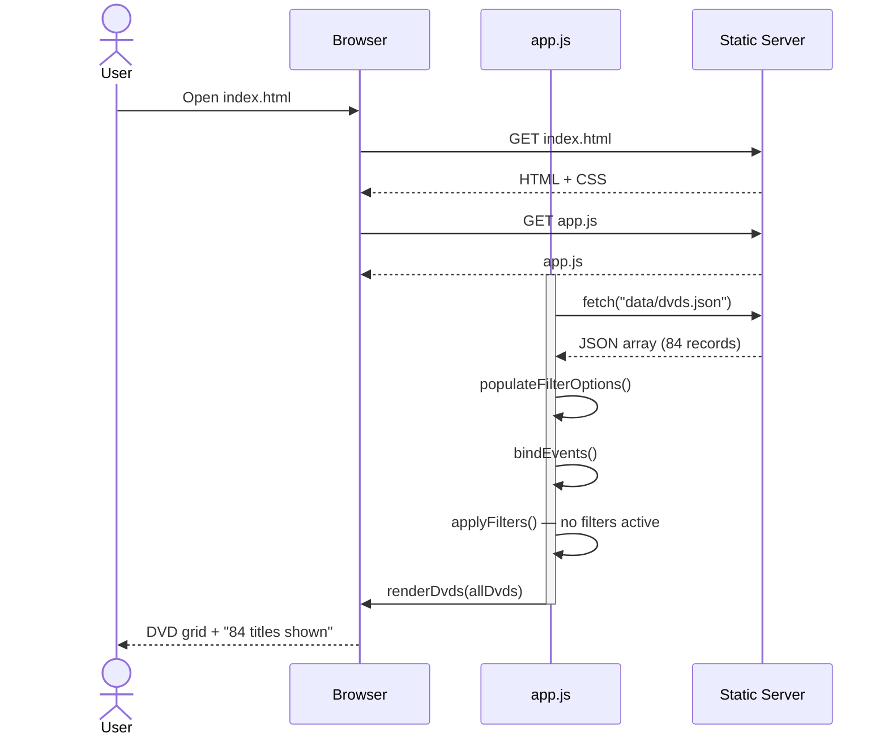
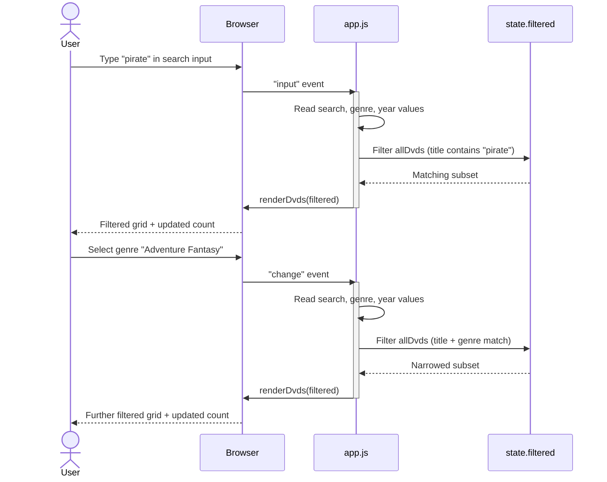
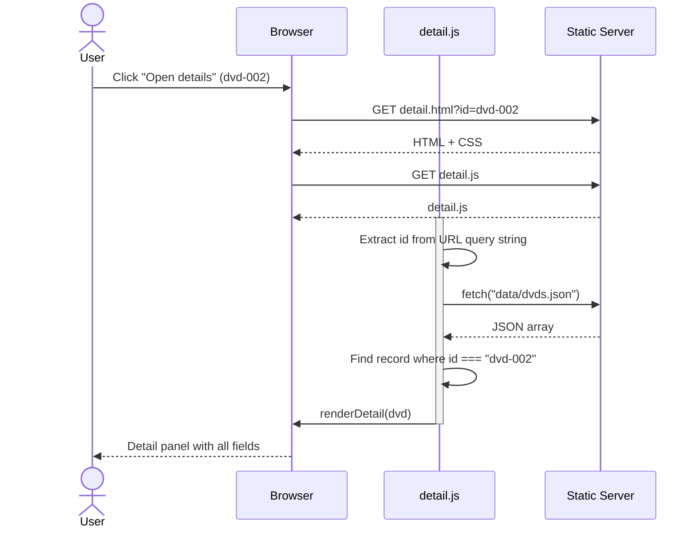
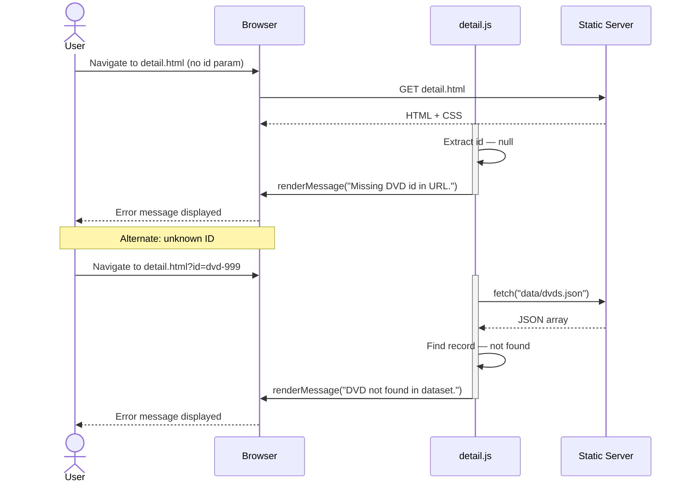
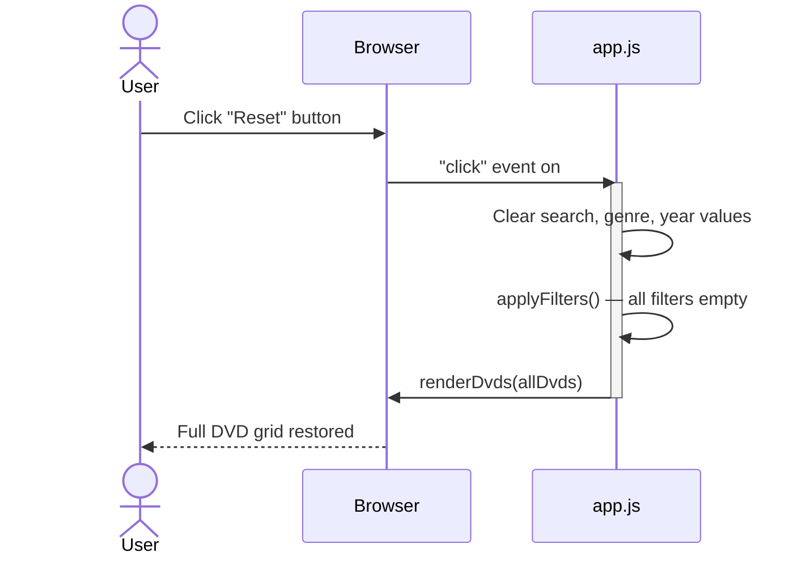

# Sequence Diagrams — DVD Shelf Database

## SD-01: Initial Page Load & Rendering

---

## SD-02: Search & Filter Interaction

---

## SD-03: View DVD Detail

---

## SD-04: Detail Page — Error Handling

---

## SD-05: Reset Filters

