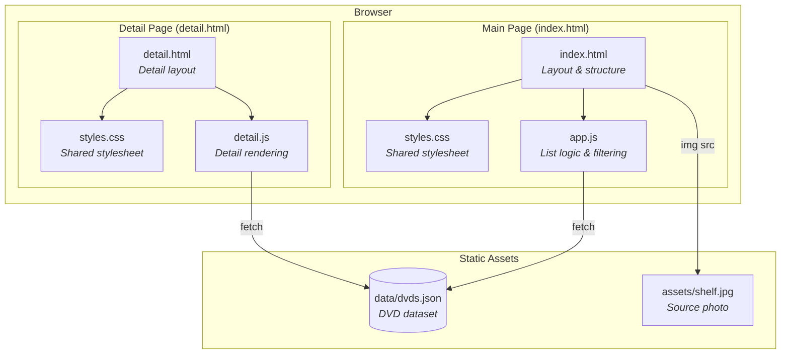
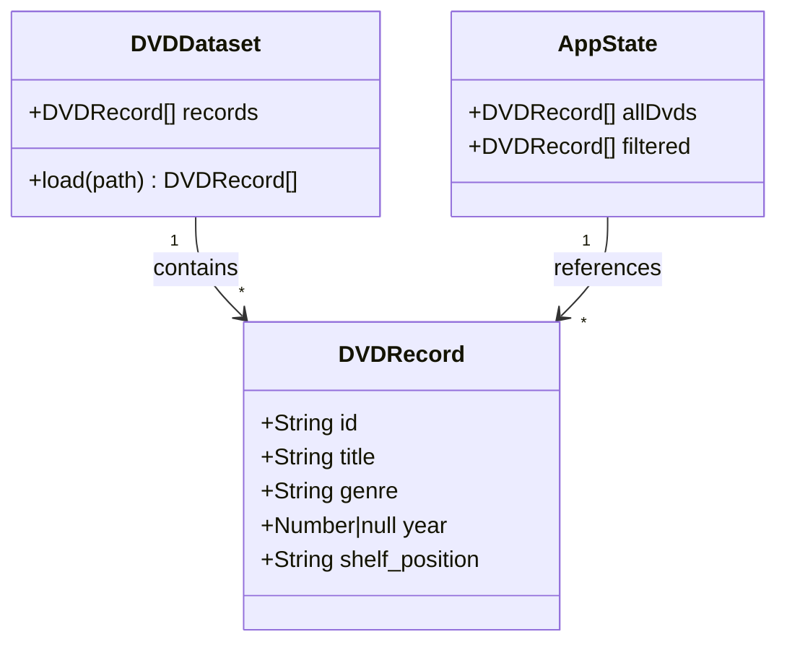
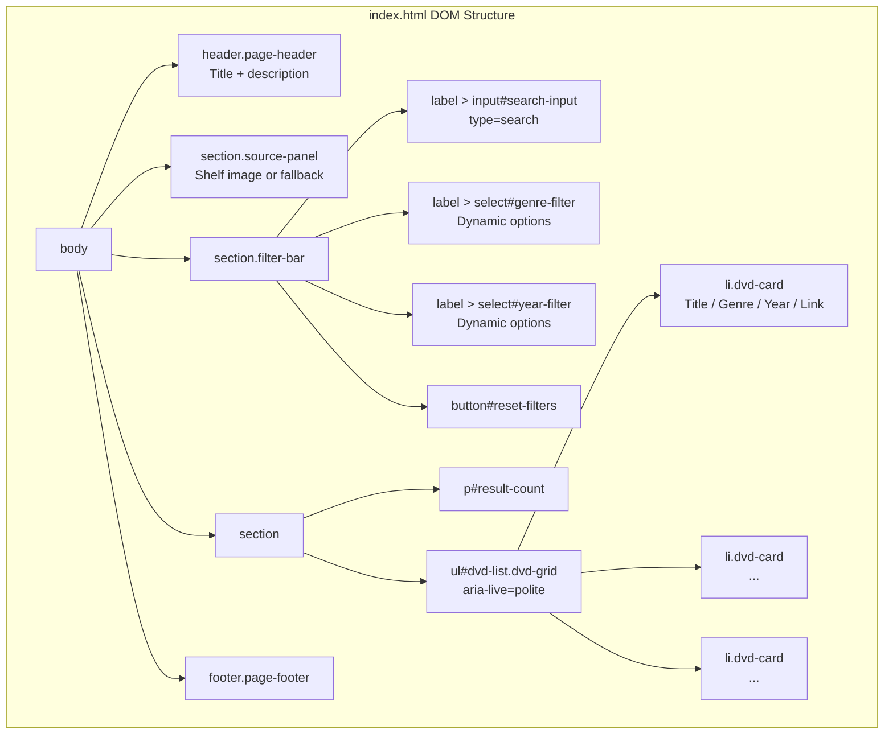
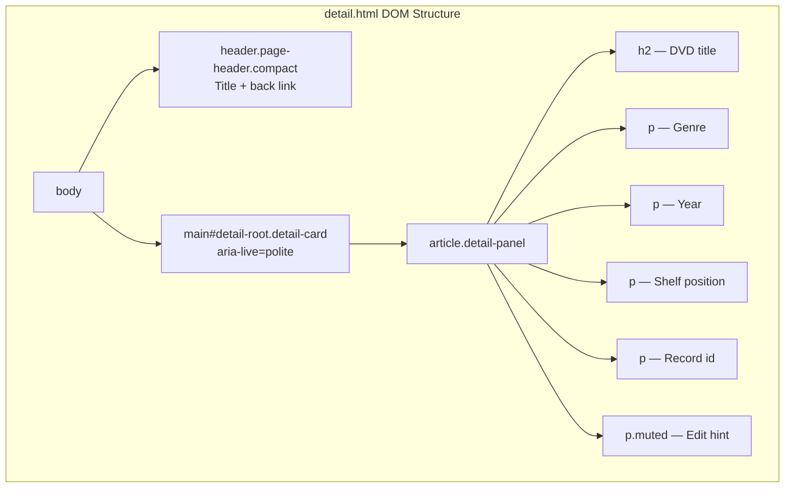
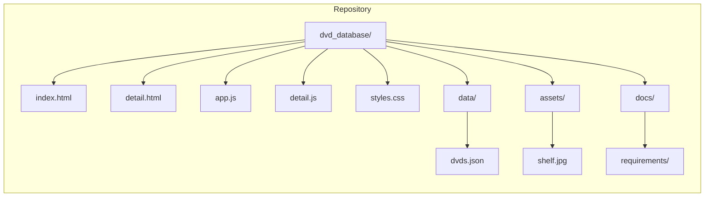

# Structural Diagrams — DVD Shelf Database

## Component Diagram

```mermaid
graph TB
    subgraph Browser
        subgraph "Main Page (index.html)"
            HTML_Main[index.html<br><i>Layout & structure</i>]
            AppJS[app.js<br><i>List logic & filtering</i>]
            CSS[styles.css<br><i>Shared stylesheet</i>]
        end

        subgraph "Detail Page (detail.html)"
            HTML_Detail[detail.html<br><i>Detail layout</i>]
            DetailJS[detail.js<br><i>Detail rendering</i>]
            CSS2[styles.css<br><i>Shared stylesheet</i>]
        end
    end

    subgraph "Static Assets"
        JSON[(data/dvds.json<br><i>DVD dataset</i>)]
        IMG[assets/shelf.jpg<br><i>Source photo</i>]
    end

    HTML_Main --> CSS
    HTML_Main --> AppJS
    AppJS -->|fetch| JSON
    HTML_Main -->|img src| IMG

    HTML_Detail --> CSS2
    HTML_Detail --> DetailJS
    DetailJS -->|fetch| JSON
```

---

## Data Model

```mermaid
classDiagram
    class DVDRecord {
        +String id
        +String title
        +String genre
        +Number|null year
        +String shelf_position
    }

    class DVDDataset {
        +DVDRecord[] records
        +load(path) DVDRecord[]
    }

    class AppState {
        +DVDRecord[] allDvds
        +DVDRecord[] filtered
    }

    DVDDataset "1" --> "*" DVDRecord : contains
    AppState "1" --> "*" DVDRecord : references
```

---

## Page Structure — Main Page

```mermaid
graph TD
    subgraph "index.html DOM Structure"
        ROOT[body]
        ROOT --> HEADER[header.page-header<br>Title + description]
        ROOT --> SOURCE[section.source-panel<br>Shelf image or fallback]
        ROOT --> FILTERS[section.filter-bar]
        ROOT --> CONTENT[section]
        ROOT --> FOOTER[footer.page-footer]

        FILTERS --> SEARCH[label > input#search-input<br>type=search]
        FILTERS --> GENRE[label > select#genre-filter<br>Dynamic options]
        FILTERS --> YEAR[label > select#year-filter<br>Dynamic options]
        FILTERS --> RESET[button#reset-filters]

        CONTENT --> COUNT[p#result-count]
        CONTENT --> GRID[ul#dvd-list.dvd-grid<br>aria-live=polite]
        GRID --> CARD1[li.dvd-card<br>Title / Genre / Year / Link]
        GRID --> CARD2[li.dvd-card<br>...]
        GRID --> CARDN[li.dvd-card<br>...]
    end
```

---

## Page Structure — Detail Page

```mermaid
graph TD
    subgraph "detail.html DOM Structure"
        ROOT2[body]
        ROOT2 --> HEADER2[header.page-header.compact<br>Title + back link]
        ROOT2 --> MAIN[main#detail-root.detail-card<br>aria-live=polite]

        MAIN --> ARTICLE[article.detail-panel]
        ARTICLE --> TITLE2[h2 — DVD title]
        ARTICLE --> GENRE2[p — Genre]
        ARTICLE --> YEAR2[p — Year]
        ARTICLE --> SHELF[p — Shelf position]
        ARTICLE --> RECID[p — Record id]
        ARTICLE --> HINT[p.muted — Edit hint]
    end
```

---

## File Structure

```mermaid
graph LR
    subgraph Repository
        ROOT[dvd_database/]
        ROOT --> INDEX[index.html]
        ROOT --> DETAIL[detail.html]
        ROOT --> APPJS[app.js]
        ROOT --> DETAILJS[detail.js]
        ROOT --> STYLES[styles.css]
        ROOT --> DATA[data/]
        ROOT --> ASSETS[assets/]
        ROOT --> DOCS[docs/]

        DATA --> DVDJSON[dvds.json]
        ASSETS --> SHELF[shelf.jpg]
        DOCS --> REQ[requirements/]
    end
```
