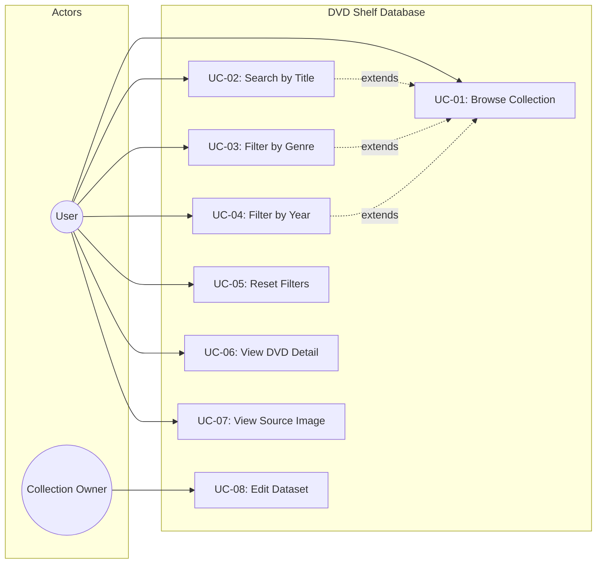

# Use Cases — DVD Shelf Database

## Use Case Diagram

---

## Use Case Descriptions

### UC-01: Browse Collection

| Field            | Value                                                      |
|------------------|------------------------------------------------------------|
| **Actor**        | User                                                       |
| **Precondition** | The application is loaded and `dvds.json` has been fetched  |
| **Trigger**      | User opens the main page                                   |
| **Main Flow**    | 1. Application loads all DVD records from JSON. 2. Records are rendered as a card grid. 3. Result count is displayed. |
| **Postcondition**| All DVDs are visible in the grid                           |

### UC-02: Search by Title

| Field            | Value                                                      |
|------------------|------------------------------------------------------------|
| **Actor**        | User                                                       |
| **Precondition** | DVD list is displayed                                      |
| **Trigger**      | User types in the search input                             |
| **Main Flow**    | 1. User enters text into the search field. 2. On each keystroke the list filters by case-insensitive substring match on title. 3. Result count updates. |
| **Alt Flow**     | If no DVDs match, a "No results" message is shown.         |
| **Postcondition**| Only matching DVDs are visible                             |

### UC-03: Filter by Genre

| Field            | Value                                                      |
|------------------|------------------------------------------------------------|
| **Actor**        | User                                                       |
| **Precondition** | DVD list is displayed                                      |
| **Trigger**      | User selects a genre from the dropdown                     |
| **Main Flow**    | 1. User picks a genre. 2. List is filtered to exact genre matches (combined with other active filters). 3. Result count updates. |
| **Postcondition**| Only DVDs of the selected genre are visible                |

### UC-04: Filter by Year

| Field            | Value                                                      |
|------------------|------------------------------------------------------------|
| **Actor**        | User                                                       |
| **Precondition** | DVD list is displayed                                      |
| **Trigger**      | User selects a year from the dropdown                      |
| **Main Flow**    | 1. User picks a year. 2. List is filtered to that year (combined with other active filters). 3. Result count updates. |
| **Postcondition**| Only DVDs from the selected year are visible               |

### UC-05: Reset Filters

| Field            | Value                                                      |
|------------------|------------------------------------------------------------|
| **Actor**        | User                                                       |
| **Precondition** | One or more filters are active                             |
| **Trigger**      | User clicks the "Reset" button                             |
| **Main Flow**    | 1. All filter inputs are cleared. 2. `applyFilters()` runs with empty values. 3. Full DVD list is restored. |
| **Postcondition**| All DVDs are visible, all inputs are empty                 |

### UC-06: View DVD Detail

| Field            | Value                                                      |
|------------------|------------------------------------------------------------|
| **Actor**        | User                                                       |
| **Precondition** | DVD list is displayed                                      |
| **Trigger**      | User clicks "Open details" on a DVD card                   |
| **Main Flow**    | 1. Browser navigates to `detail.html?id=<dvd-id>`. 2. Detail page fetches `dvds.json`. 3. Record is located by ID and rendered with all fields. |
| **Alt Flow A**   | Missing `id` parameter — error message displayed.          |
| **Alt Flow B**   | ID not found in dataset — error message displayed.         |
| **Postcondition**| DVD detail is shown with a back link to the list           |

### UC-07: View Source Image

| Field            | Value                                                      |
|------------------|------------------------------------------------------------|
| **Actor**        | User                                                       |
| **Precondition** | Main page is loaded                                        |
| **Trigger**      | Automatic on page load                                     |
| **Main Flow**    | 1. Browser attempts to load `assets/shelf.jpg`. 2. If found, the image is displayed in the source panel. |
| **Alt Flow**     | Image missing — `onerror` handler hides the `` and shows a fallback message. |

### UC-08: Edit Dataset

| Field            | Value                                                      |
|------------------|------------------------------------------------------------|
| **Actor**        | Collection Owner                                           |
| **Precondition** | Owner has file system access to the repository             |
| **Trigger**      | Owner wants to add, update, or remove a DVD record         |
| **Main Flow**    | 1. Owner opens `data/dvds.json` in a text editor. 2. Owner adds, modifies, or deletes a JSON entry. 3. Owner saves the file and reloads the browser. |
| **Postcondition**| Changes are reflected on the next page load                |
